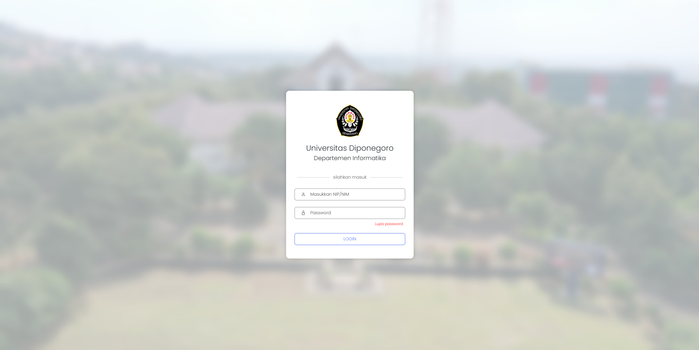
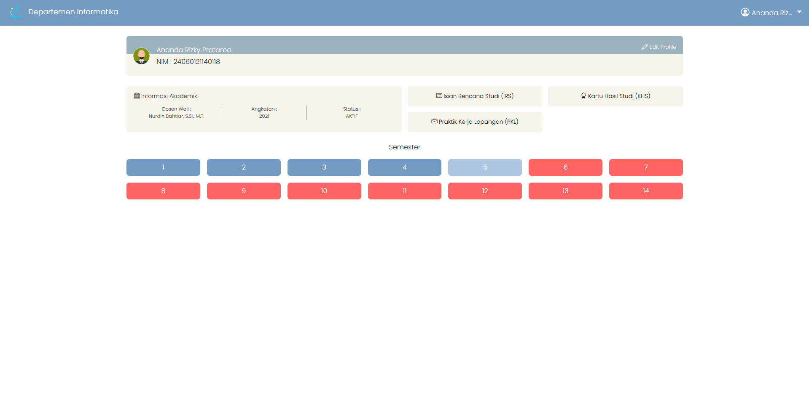
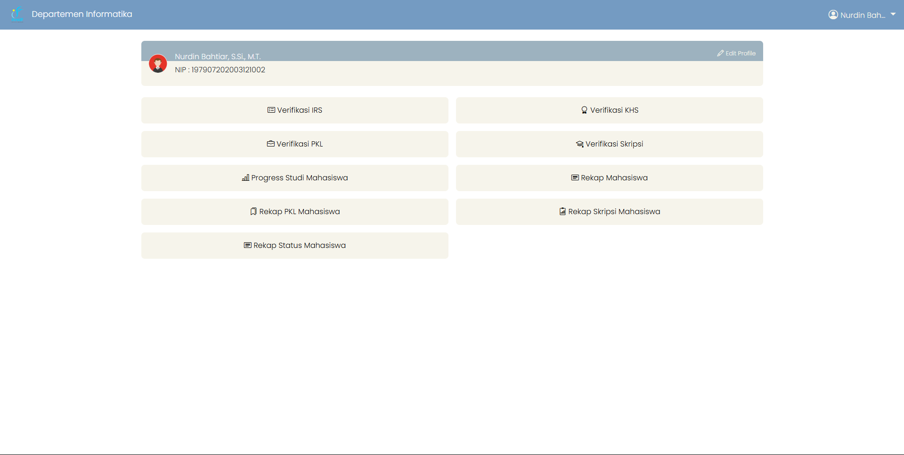
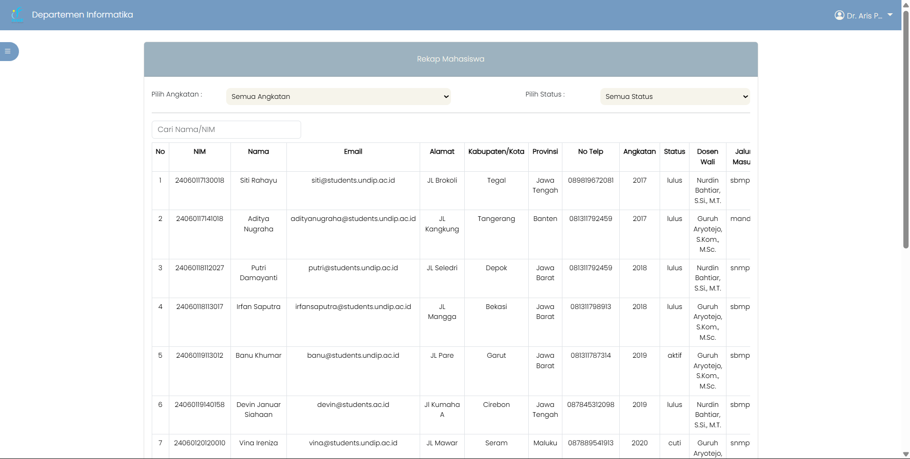
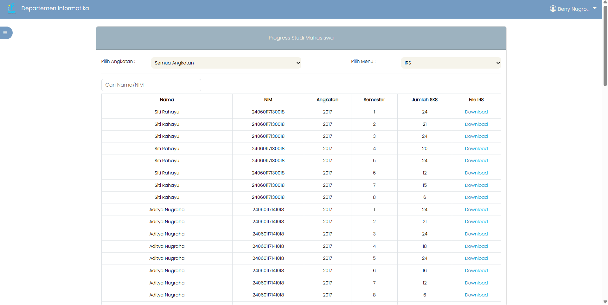

# 🎓 Simple Student Monitoring System

<div align="center">
  
  
  
  ### *A comprehensive Laravel-MySQL student progress monitoring platform*
  
  [](https://laravel.com/)
  [](https://php.net/)
  [](https://mysql.com/)
  
  *Inspired by UNDIP's SIAP (Sistem Informasi Akademik Universitas Diponegoro)*
  
</div>

---

## ✨ Overview

> **My first group project** showcasing academic progress monitoring with multi-role authentication system.

This comprehensive student monitoring system provides a seamless experience for tracking academic progress across multiple user roles. Built with simple views, it offers intuitive interfaces for mahasiswa, dosen wali, departemen, and operator.

### 🎯 Key Features

- 📊 **Real-time Progress Tracking** - Monitor academic performance instantly
- 👥 **Multi-Role Authentication** - Secure access for different user types
- 🔐 **Secure Data Management** - Robust user authentication and authorization
- 📱 **Responsive Design** - Works seamlessly across all devices

---

## 👥 User Roles & Permissions

<div align="center">

| 🎓 Role | 📝 Description | 🔑 Key Features |
|---------|----------------|------------------|
| **Mahasiswa** | Student portal for academic tracking | View progress, grades, and study records |
| **Dosen Wali** | Academic advisor supervision | Monitor and verify student progress |
| **Departemen** | Department-level oversight | Comprehensive student analytics |
| **Operator** | System administration | User management and data control |

</div>

> **My Contribution:** Led database schema design and co-developed the entire back-end architecture

---

## 🛠️ Technology Stack

<div align="center">

### Backend


### Frontend


</div>

---

## 📸 Application Screenshots

<details>
<summary>🖼️ <strong>Click to view application interface</strong></summary>

<br>

<div align="center">

### 🔐 Authentication


### 🎓 Mahasiswa - Dashboard


### 👨‍🏫 Dosen Wali - Dashboard


### 🏢 Departemen - Rekap Mahasiswa


### ⚙️ Operator - Progress Studi


</div>

</details>

---

## 🚀 Quick Start Guide

### Prerequisites
- 🐘 **PHP 8.1+**
- 🎵 **Composer**
- 🗄️ **MySQL 8.0+**
- 📦 **Node.js & NPM**

### Installation

```bash
# 📥 Clone the repository
git clone https://github.com/bonifasiusbryan1/Simple-Student-Monitoring-System.git
cd Simple-Student-Monitoring-System

# 📦 Install dependencies
composer install && npm install

# ⚙️ Environment setup
cp .env.example .env
# Configure your database settings in .env

# 🗄️ Database setup
mysql -u root -p -e "CREATE DATABASE monitoring_mahasiswa;"
mysql -u root -p monitoring_mahasiswa < monitoring_mahasiswa.sql

# 🔑 Generate application key
php artisan key:generate

# 🔗 Create storage symlink
php artisan storage:link

# 🚀 Launch the application
php artisan serve
```

### 🌐 Access the Application
Open your browser and navigate to: `http://127.0.0.1:8000`

---

## 📂 Project Structure

```
Simple-Student-Monitoring-System/
├── 📁 app/                 # Application core files
├── 📁 database/            # Database migrations & seeds
├── 📁 public/              # Public assets & screenshots
├── 📁 resources/           # Views, CSS, JS resources
├── 📁 routes/              # Application routes
└── 📄 monitoring_mahasiswa.sql  # Database schema
```

</div>
